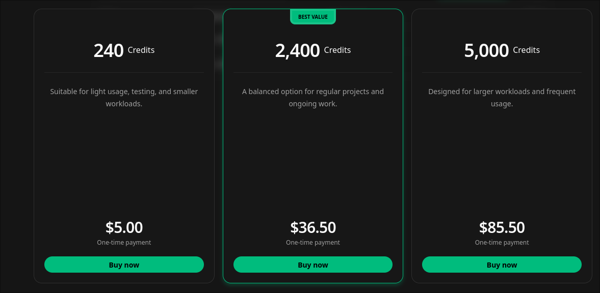
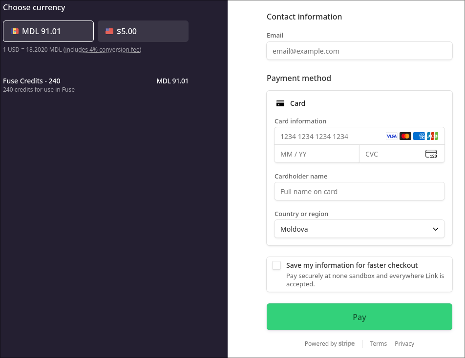
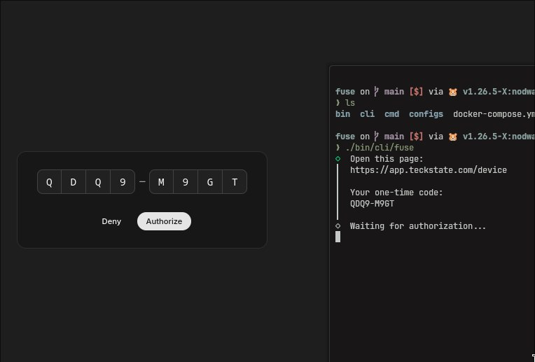
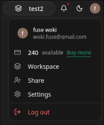

# Fuse

Fast hosting for game servers, Telegram bots, websites, APIs, databases, background workers, and other services.

**Live application:** [app.teckstate.com](https://app.teckstate.com)

[](https://github.com/box1o/fuse/actions/workflows/ci.yml)
[](https://go.dev/)
[](https://react.dev/)
[](https://www.typescriptlang.org/)
[](https://www.docker.com/)

## Overview

Fuse provides a simple way to launch and manage hosted services without complex infrastructure setup.

Use it to quickly host a Minecraft server, Telegram bot, website, API, temporary database, background worker, or another application.

Fuse combines a web interface, backend API, command-line client, and isolated compute runtime in one platform.

## Preview

<table align="center">
  <tr>
    <td align="center">
      <kbd>
        
      </kbd>
    </td>
    <td align="center">
      <kbd>
        
      </kbd>
    </td>
  </tr>
  <tr>
    <td colspan="2">
      <table align="center">
        <tr>
          <td align="center">
            <kbd>
              
            </kbd>
          </td>
          <td align="center">
            <kbd>
              
            </kbd>
          </td>
          <td align="center">
            <kbd>
              
            </kbd>
          </td>
        </tr>
      </table>
    </td>
  </tr>
</table>

## Fuse CLI

Fuse includes a command-line client for managing the platform without opening the web interface.

The CLI currently supports device-flow authentication, session status checks, logout, interactive terminal menus, direct commands, JSON output, and non-interactive execution.

The goal is for the CLI to expose the same functionality available in the web interface, including workspace management, compute instances, deployments, logs, credits, usage, and service configuration.

This makes the CLI suitable for scripts, CI pipelines, development tools, and AI agents. Agents can use structured output and non-interactive commands to deploy services, inspect failures, read logs, and manage workloads automatically.

```bash
fuse auth login
fuse auth status
fuse auth status --json
fuse auth logout
```

Build the CLI:

```bash
make cli
./bin/cli/fuse --version
```

## Rune Runtime

Fuse uses Rune as its underlying compute runtime.

Rune builds reusable Linux images and executes isolated jobs inside lightweight Firecracker microVMs. It manages image caching, virtual machines, CPU and memory resources, writable volumes, job queues, and durable logs.

Rune is implemented as a modular Bash platform and can be extended with additional runtimes, storage systems, networking features, and hosting workloads.

## Run locally

Create the backend environment file and add your local credentials:

```bash
cp .env.development.example .env
make run
```

Start the frontend:

```bash
cd web
bun install
bun run dev
```

## Docker

```bash
docker compose up --build
```

Production secrets must be provided through the deployment environment and must not be committed.
